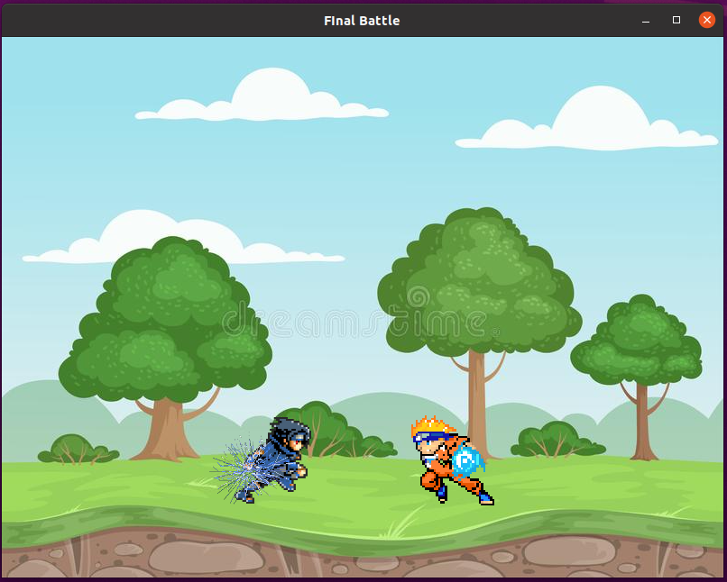

# List 04

This repository contains the exercicios proposed by list 04 of the subject *Processamento Gráfico*.

| ex number | source                          | executable                  |
|-----------|---------------------------------|-----------------------------|
| 01        | [source.cpp](./src/Source.cpp)  | [app.exe](./app)            |

## Running in Windows

I got sick of trying to make these exercises in Visual Studio for Windows, errors made no sense at all and configurations were to confusing. So, finally, I downloaded VmWare and am now workin in a Ubuntu envirnonment.

This said, Im't not sure how to make this project run in Windows.

## Running in Linux

`shell
$ g++ src/Source.cpp src/glad.c src/SceneManager.cpp src/Sprite.cpp src/stb_image.cpp -g -o app -Iinclude -lglfw -ldl^C
$ ./app
` 

And there you are:

